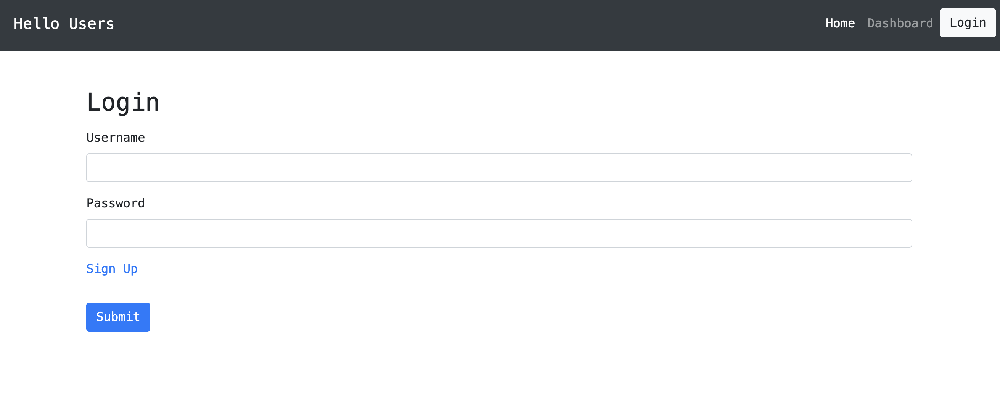
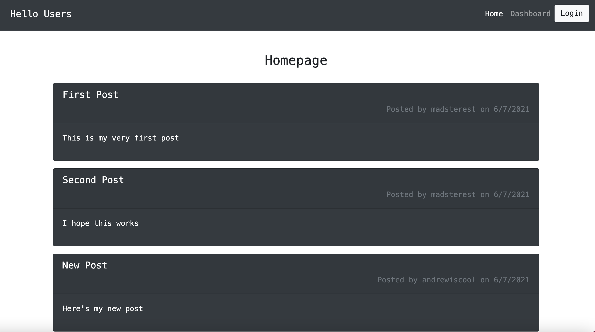
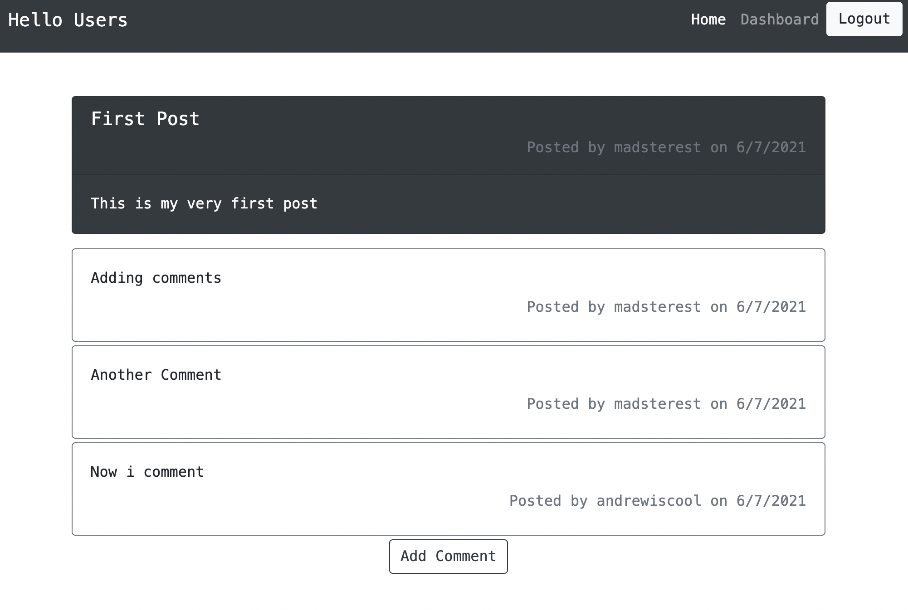

# tech-forum

 # Description
 
 This site was developed to help discuss tech related issues.
 This field is constantly changing, so we need to rely on each other for help and guidance. This provides a space for users to ask questions or post interesting articles that tech pros and newbies will find helpful and interesting.
 This site allows you to post either blogs or questions that will be uploaded to the homepage. Other users can then comment and provide feedback. The posts can each be deleted or updated by the user.

 # Table of Contents
 
 * [Installation](#installation)
 * [Useage](#useage)
* [Contributing](#contributing)
 * [License](#license)
 * [Questions](#questions)

 # Installation
 This site is deployed at 

 # Useage
 This site requires the user to have login details. Once you Sign Up, you can upload your own blog posts or comment on other users.
 
 

 # Contributing
 Created by Madeleine O'Dea
 

 # License
  Licensed under MIT.
  For more information, visit this link.
  https://opensource.org/licenses/MIT
  
  
# Questions
For more examples of my work, please visit my GitHub at [madsterest](https://github.com/madsterest)
or contact me at
odea.madeleine@gmail.com
